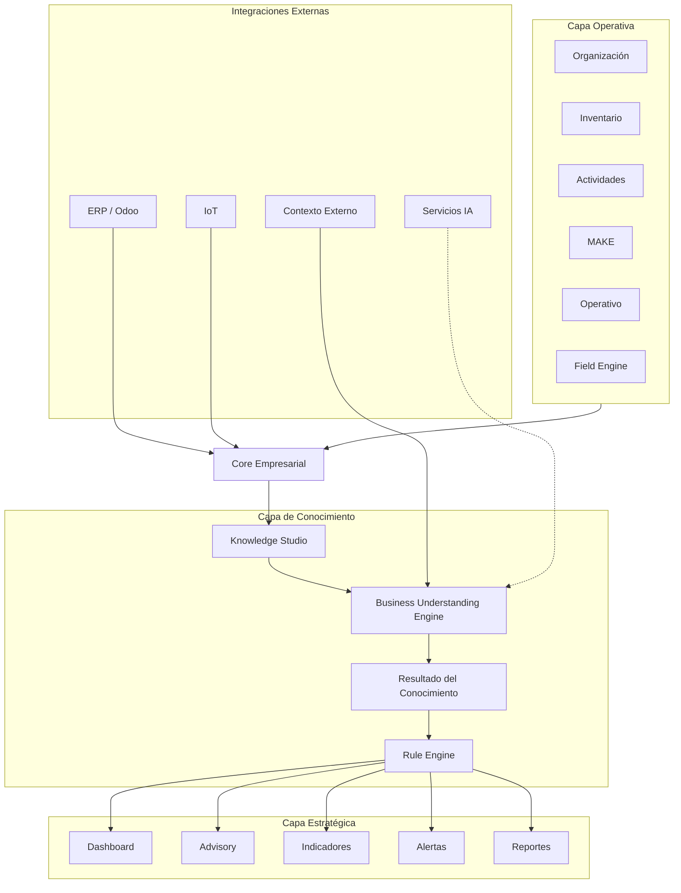

# UML-001 - Arquitectura Funcional de GANUS

**Código:** UML-001

**Versión:** 1.0

**Estado:** En construcción

**Proyecto:** GANUS Enterprise Platform

---

# 1. Objetivo

Definir la arquitectura funcional de GANUS Enterprise Platform, mostrando cómo colaboran los principales componentes de la plataforma para transformar la operación del negocio en conocimiento empresarial.

Este documento constituye la base arquitectónica funcional sobre la cual se desarrollarán el Core Empresarial, Knowledge Studio y los demás modelos UML.

---

# 2. Alcance

Este documento describe únicamente la colaboración funcional entre los grandes componentes de la plataforma.

No representa clases.

No representa entidades del dominio.

No representa tablas de base de datos.

El detalle del dominio será desarrollado posteriormente en UML-002 y UML-003.

---

# 3. Principios Arquitectónicos

La Arquitectura Funcional de GANUS se fundamenta en los siguientes principios:

- Existe un único Core Empresarial.
- Todos los módulos comparten el mismo Modelo Empresarial.
- Knowledge Studio constituye el núcleo de comprensión del negocio.
- Business Understanding Engine interpreta el contexto empresarial.
- Rule Engine aplica las reglas del negocio.
- Dashboard, Advisory y Reportes consumen conocimiento, nunca modifican el dominio.
- La Inteligencia Artificial constituye un servicio externo desacoplado del Core.

---

# 4. Capas Funcionales

La plataforma se encuentra organizada en cinco capas funcionales.

## 4.1 Capa Operativa

Responsable de ejecutar la operación del negocio y producir información.

Está conformada por:

- Organización
- Inventario
- Actividades
- MAKE
- Operativo
- Field Engine

---

## 4.2 Core Empresarial

Responsable de centralizar el Modelo Empresarial, las reglas del dominio y la lógica reutilizable para toda la plataforma.

---

## 4.3 Capa de Conocimiento

Responsable de interpretar el negocio y construir conocimiento empresarial.

Está conformada por:

- Knowledge Studio
- Business Understanding Engine
- Resultado del Conocimiento
- Rule Engine

---

## 4.4 Capa Estratégica

Responsable de consumir el conocimiento generado por la plataforma.

Está conformada por:

- Dashboard
- Advisory
- Indicadores
- Alertas
- Reportes

---

## 4.5 Integraciones Externas

Corresponde a los servicios externos que enriquecen el conocimiento empresarial.

Incluye:

- ERP
- Sistemas IoT
- Contexto Externo
- Servicios de Inteligencia Artificial

---

# 5. Arquitectura Funcional

---

# 6. Flujo Funcional

El funcionamiento general de la plataforma sigue el siguiente flujo:

1. Los módulos operativos ejecutan los procesos del negocio.

2. El Core Empresarial consolida toda la información dentro del Modelo Empresarial.

3. Knowledge Studio interpreta las relaciones existentes entre las entidades del dominio.

4. Business Understanding Engine analiza el contexto empresarial completo.

5. El análisis genera uno o varios Resultados del Conocimiento.

6. Rule Engine evalúa dichos resultados utilizando las reglas del negocio.

7. Dashboard, Advisory, Indicadores, Alertas y Reportes consumen el conocimiento generado para apoyar la toma de decisiones.

---

# 7. Responsabilidades de los Componentes

## Capa Operativa

Produce información del negocio.

No interpreta conocimiento.

---

## Core Empresarial

Centraliza:

- Entidades
- Reglas
- Eventos
- Servicios
- Agregados

Constituye la única fuente oficial del dominio.

---

## Knowledge Studio

Comprende el negocio utilizando el Modelo Empresarial.

No modifica información operativa.

---

## Business Understanding Engine

Analiza el contexto completo del negocio.

Construye conocimiento empresarial.

---

## Resultado del Conocimiento

Representa el principal producto generado por Knowledge Studio.

Podrá clasificarse como:

- Hallazgo
- Riesgo
- Oportunidad
- Recomendación
- Tendencia
- Observación

---

## Rule Engine

Evalúa el conocimiento generado.

Aplica reglas empresariales.

Genera indicadores, alertas y acciones.

---

## Dashboard

Presenta el estado estratégico de la organización.

---

## Advisory

Genera apoyo para la toma de decisiones.

---

## Reportes

Consolida información empresarial.

---

# 8. Relación con ARQ-001

ARQ-001 define la arquitectura empresarial de GANUS.

UML-001 representa la colaboración funcional entre los principales componentes definidos en dicha arquitectura.

Ambos documentos son complementarios.

---

# 9. Relación con DOM-001

DOM-001 define el Modelo Empresarial.

UML-001 representa cómo dicho modelo es utilizado por los componentes funcionales de la plataforma.

No reemplaza el Modelo Empresarial.

Lo utiliza como fundamento.

---

# 10. Preparación para UML-002

El siguiente documento desarrollará el Modelo de Relaciones del Dominio.

A partir de allí comenzará el diseño formal del Core Empresarial mediante entidades, relaciones y agregados definidos en DOM-001.