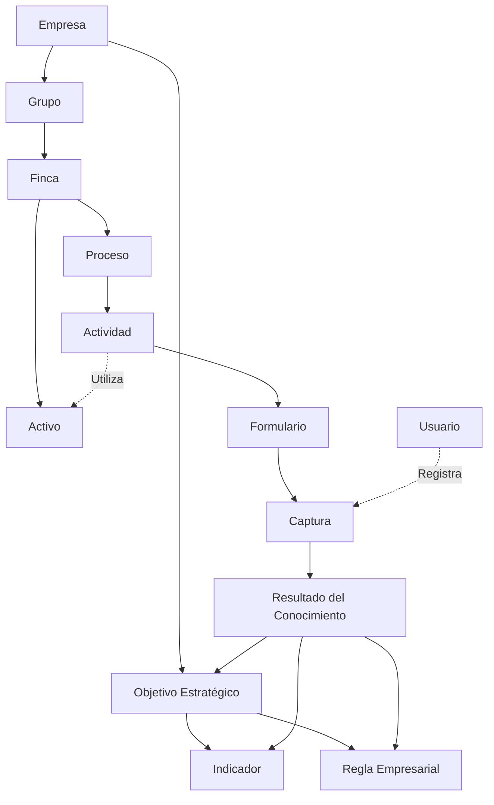

# UML-002 - Modelo de Relaciones del Dominio

**Código:** UML-002

**Versión:** 1.0

**Estado:** En construcción

**Proyecto:** GANUS Enterprise Platform

---

# 1. Objetivo

Representar gráficamente las relaciones oficiales entre las entidades del Modelo Empresarial de GANUS.

Este documento constituye el puente entre el Modelo Empresarial (DOM-001) y el Modelo de Clases del Dominio (UML-003).

No representa implementación de software.

No representa base de datos.

No representa componentes técnicos.

Representa exclusivamente la estructura del dominio empresarial.

---

# 2. Alcance

Este documento describe:

- Las entidades oficiales del dominio.
- Las relaciones existentes entre ellas.
- La estructura organizacional del negocio.
- La estructura operativa.
- La estructura estratégica.

No incluye:

- Interfaces.
- Servicios.
- Eventos.
- Repositorios.
- Casos de uso.
- Arquitectura técnica.

---

# 3. Principios

Las relaciones representadas en este documento cumplen los siguientes principios:

- Toda entidad pertenece al Modelo Empresarial.
- Toda relación representa una necesidad real del negocio.
- Ninguna relación existe por razones técnicas.
- El dominio permanece independiente de la tecnología.
- El documento constituye la base para el Modelo de Clases del Dominio.

---

# 4. Entidades del Dominio

Las entidades oficiales del Modelo Empresarial son:

- Empresa
- Grupo
- Finca
- Proceso
- Actividad
- Activo
- Formulario
- Captura
- Usuario
- Objetivo Estratégico
- Indicador
- Regla Empresarial
- Resultado del Conocimiento

---

# 5. Modelo de Relaciones

---

# 6. Interpretación

La Empresa constituye la raíz del Modelo Empresarial.

La organización se estructura mediante Grupos y Fincas.

Cada Finca administra sus Procesos, Actividades y Activos.

Las Actividades ejecutan la operación del negocio mediante Formularios que generan Capturas.

Las Capturas representan la principal evidencia de la operación.

A partir de las Capturas se construyen Resultados del Conocimiento.

Los Resultados del Conocimiento fortalecen los Objetivos Estratégicos, los Indicadores y las Reglas Empresariales.

Este modelo representa exclusivamente las relaciones del negocio.

No representa implementación de software.

---

# 7. Relación con DOM-001

Todas las entidades representadas en este documento provienen del Modelo Empresarial aprobado (DOM-001).

No se incorporan nuevas entidades.

No se modifican las reglas del negocio.

No se alteran las responsabilidades del dominio.

---

# 8. Preparación para UML-003

El siguiente documento (UML-003) transformará este modelo de relaciones en un Modelo de Clases del Dominio.

Cada entidad incorporará:

- Atributos.
- Responsabilidades.
- Relaciones UML.
- Enumeraciones.
- Value Objects.
- Restricciones del dominio.

Sin modificar la estructura empresarial definida en este documento.