# UML-003 – Modelo de Clases del Dominio

| Propiedad | Valor |
|-----------|-------|
| Código | UML-003 |
| Nombre | Modelo de Clases del Dominio |
| Proyecto | GANUS Enterprise Platform |
| Estado | En construcción |
| Versión | 1.0 |

---

# 1. Introducción

El Modelo de Clases del Dominio constituye la representación conceptual del núcleo empresarial de GANUS Enterprise Platform.

Su propósito es identificar y organizar las clases que representan los conceptos fundamentales del negocio, así como las relaciones existentes entre ellas, proporcionando una visión independiente de cualquier tecnología o lenguaje de programación.

Este documento forma parte de la arquitectura funcional de la plataforma y servirá como base para la construcción del Core Empresarial, el desarrollo de los servicios de aplicación, la implementación del backend y la elaboración de los demás artefactos UML del proyecto.

Las clases aquí descritas representan únicamente conceptos del dominio del negocio. No corresponden a entidades de base de datos, clases de programación ni componentes técnicos.

---

# 2. Objetivo

Definir el Modelo de Clases del Dominio de GANUS Enterprise Platform mediante la identificación de las clases oficiales del negocio, sus responsabilidades y las relaciones conceptuales existentes entre ellas.

Este documento constituye la referencia arquitectónica para el diseño del Core Empresarial y garantiza la coherencia entre la arquitectura del dominio, la implementación del software y la evolución futura de la plataforma.

---

# 3. Alcance

El presente documento comprende exclusivamente el modelo conceptual del dominio.

Incluye:

- Clases oficiales del negocio.
- Relaciones conceptuales entre clases.
- Organización del dominio por capacidades funcionales.
- Responsabilidades generales de cada clase.
- Interpretación arquitectónica de cada dominio.

No incluye:

- Diseño físico de base de datos.
- Atributos.
- Métodos.
- Interfaces.
- APIs.
- Diagramas de secuencia.
- Diagramas de actividad.
- Diagramas de estados.
- Diagramas de componentes.
- Diagramas de despliegue.
- Implementación técnica.

---

# 4. Fuentes Oficiales

El Modelo de Clases del Dominio se desarrolla exclusivamente a partir de la documentación oficial de GANUS Enterprise Platform.

Las clases documentadas deberán derivarse únicamente de las siguientes fuentes:

- ARQ-001 – Arquitectura Empresarial.
- DOM-001 – Modelo del Dominio.
- Diccionario Maestro.
- Modelo Dinámico.
- Modelo Entidad–Relación.
- DDL PostgreSQL.
- Vision Knowledge.
- MVP.
- Hallazgos Oficiales del Proyecto.

No se incorporarán clases, relaciones o responsabilidades que no estén respaldadas por alguno de estos documentos.

---

# 5. Principios del Modelo

El Modelo de Clases del Dominio se construye bajo los siguientes principios arquitectónicos.

## 5.1 Independencia Tecnológica

Las clases representan conceptos del negocio y no componentes de software.

## 5.2 Orientación al Negocio

Cada clase existe porque representa una necesidad del negocio.

## 5.3 Coherencia Arquitectónica

Todas las decisiones deberán mantenerse alineadas con la arquitectura oficial de GANUS.

## 5.4 Evolución Controlada

La incorporación de nuevas clases únicamente podrá realizarse cuando exista una modificación oficial del negocio.

## 5.5 Uniformidad

Todos los dominios seguirán exactamente la misma estructura documental.

---

# 6. Estructura del Documento

El Modelo de Clases del Dominio será desarrollado por dominios funcionales.

Cada dominio será documentado de manera independiente y deberá ser aprobado antes de iniciar el siguiente.

Todos los dominios utilizarán exactamente la siguiente estructura:

- Objetivo.
- Clases Oficiales.
- Diagrama UML.
- Interpretación.
- Responsabilidades.
- Relaciones.
- Decisiones Arquitectónicas.
- Observaciones.

---

# 7. Dominio Organización

## 7.1 Objetivo

El dominio **Organización** representa la estructura empresarial sobre la cual opera GANUS Enterprise Platform.

Su responsabilidad consiste en definir la organización propietaria de la información, las unidades operativas donde se ejecutan los procesos del negocio y las personas autorizadas para interactuar con la plataforma.

Este dominio constituye el punto de partida del modelo empresarial, ya que proporciona el contexto organizacional sobre el cual se apoyan los dominios de Inventario, MAKE, Field Engine, Knowledge Studio, Dashboard, Advisory y los demás componentes del Core Empresarial.

Toda la información administrada por la plataforma deberá pertenecer a un contexto organizacional definido dentro de este dominio.

---

## 7.2 Alcance

El dominio Organización comprende la definición de la estructura empresarial básica de GANUS Enterprise Platform.

Su alcance incluye:

- La administración de grupos empresariales.
- La administración de fincas.
- La administración de usuarios.
- La administración de roles.
- La definición del contexto organizacional utilizado por el resto de la plataforma.

No forma parte del alcance de este dominio:

- La administración de activos.
- La ejecución de actividades.
- La captura de información.
- Las reglas de negocio.
- Los indicadores.
- Las alertas.
- El conocimiento empresarial.

Estas capacidades pertenecen a otros dominios del modelo.

---

## 7.3 Clases Oficiales

El dominio Organización está conformado por las siguientes clases del negocio:

| Clase | Descripción |
|--------|-------------|
| Grupo | Representa la organización empresarial propietaria de una o varias fincas dentro de la plataforma. |
| Finca | Representa la unidad operativa donde se desarrollan las actividades del negocio ganadero. |
| Usuario | Representa una persona autorizada para interactuar con la plataforma según sus responsabilidades. |
| Rol | Representa el conjunto de capacidades funcionales asignadas a un usuario dentro del sistema. |

Las clases anteriores constituyen el núcleo del dominio Organización y proporcionan el contexto organizacional requerido por los demás dominios del Core Empresarial.

---

## 7.4 Diagrama UML

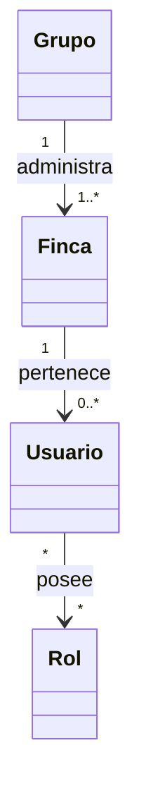

El diagrama representa las relaciones conceptuales existentes entre las clases principales del dominio Organización.

No incluye atributos, operaciones ni detalles de implementación, ya que estos serán incorporados en etapas posteriores del diseño del dominio.

---

## 7.5 Interpretación del Dominio

El dominio Organización constituye el punto de entrada del modelo empresarial de GANUS Enterprise Platform.

Su propósito es representar la estructura organizacional sobre la cual se desarrolla la operación del negocio ganadero y establecer el contexto que será utilizado por todos los demás dominios de la plataforma.

La organización define quién es el propietario de la información, dónde se ejecutan las actividades, quiénes participan en los procesos y cuáles son las responsabilidades asignadas a cada usuario.

Desde la perspectiva del dominio, toda la información administrada por GANUS pertenece a una organización claramente identificada y a una finca específica, permitiendo mantener la trazabilidad de los procesos empresariales.

Este dominio no administra la operación del negocio ni el conocimiento empresarial. Su responsabilidad consiste exclusivamente en establecer la estructura organizacional que soporta el funcionamiento del Core Empresarial.

## 7.6 Responsabilidades de las Clases

### Grupo

**Descripción**

Representa la organización empresarial propietaria de la información administrada por GANUS Enterprise Platform.

Constituye el nivel superior de la estructura organizacional y agrupa una o varias fincas pertenecientes a la misma empresa.

**Responsabilidades**

- Representar la organización empresarial.
- Administrar una o varias fincas.
- Proporcionar el contexto organizacional del negocio.
- Servir como entidad raíz de la estructura organizacional.

---

### Finca

**Descripción**

Representa la unidad operativa donde se desarrollan los procesos y actividades del negocio ganadero.

Toda la operación de la plataforma se ejecuta dentro del contexto de una finca.

**Responsabilidades**

- Representar la unidad operativa del negocio.
- Constituir el contexto principal para la operación.
- Servir como punto de referencia para los activos, actividades y procesos.
- Asociar la operación con una organización empresarial.

---

### Usuario

**Descripción**

Representa una persona autorizada para utilizar la plataforma.

Los usuarios interactúan con los diferentes módulos de GANUS de acuerdo con los roles que tengan asignados.

**Responsabilidades**

- Acceder a la plataforma.
- Ejecutar funciones del negocio.
- Participar en los procesos operativos y administrativos.
- Operar conforme a los permisos otorgados.

---

### Rol

**Descripción**

Representa un conjunto de capacidades funcionales asignadas a un usuario dentro de la plataforma.

Los roles determinan las funcionalidades disponibles para cada usuario.

**Responsabilidades**

- Definir las capacidades funcionales de los usuarios.
- Controlar el acceso a los módulos del sistema.
- Organizar las responsabilidades operativas y administrativas.
- Facilitar la asignación de permisos dentro de la plataforma.

---

## 7.7 Relaciones con otros Dominios

El dominio Organización proporciona el contexto empresarial utilizado por todos los demás dominios de GANUS Enterprise Platform.

Las relaciones conceptuales con los demás dominios son las siguientes:

| Dominio | Relación |
|----------|----------|
| Inventario | Todos los activos pertenecen al contexto de una finca. |
| Field Engine | Los formularios pueden asociarse a una finca según su contexto de utilización. |
| Valores | Los valores capturados pertenecen al contexto organizacional definido por la finca. |
| Identificación | Los identificadores son administrados dentro del contexto organizacional. |
| Relaciones | Las relaciones entre activos se establecen dentro de una finca. |
| MAKE | Las actividades y procesos se ejecutan sobre una finca determinada. |
| Knowledge Studio | El conocimiento empresarial se construye a partir del contexto organizacional definido. |
| Analytics | Los indicadores se calculan para una organización y sus fincas. |
| Alertas | Las alertas pertenecen al contexto de una organización y una finca. |
| Dashboard | Los tableros presentan información del contexto organizacional. |
| Advisory | Las recomendaciones consideran la organización, la finca y los usuarios involucrados. |

El dominio Organización constituye el contexto principal sobre el cual se soporta el Core Empresarial de GANUS Enterprise Platform.

---

## 7.8 Decisiones Arquitectónicas

Durante el diseño del dominio Organización se adoptan las siguientes decisiones arquitectónicas:

- Grupo constituye la raíz del dominio Organización.
- Una organización administra una o varias fincas.
- La finca representa la unidad operativa oficial del negocio.
- Todo usuario pertenece al contexto organizacional definido por una finca.
- Los permisos funcionales son administrados mediante roles.
- El dominio Organización no administra procesos operativos, activos, indicadores ni conocimiento empresarial.
- Los demás dominios del Core Empresarial utilizan Organización como contexto base para la operación.

Estas decisiones deberán mantenerse consistentes durante la evolución del modelo del dominio.

---

## 7.9 Observaciones

El dominio Organización representa exclusivamente la estructura organizacional del negocio.

Los conceptos relacionados con inventario, ejecución de actividades, captura de información, conocimiento empresarial, indicadores, alertas y procesos operativos serán documentados en sus respectivos dominios.

La incorporación de nuevas clases dentro del dominio Organización únicamente podrá realizarse cuando exista una modificación oficial del negocio o de la arquitectura empresarial.

Con la aprobación de este dominio se establece el contexto organizacional utilizado por el resto del Modelo de Clases del Dominio.

---

# 8. Dominio Inventario

## 8.1 Objetivo

El dominio **Inventario** representa el conjunto de activos administrados por GANUS Enterprise Platform.

Su propósito consiste en definir la estructura mediante la cual la organización registra, clasifica, administra y consulta todos los recursos que forman parte de la operación del negocio.

Los activos constituyen uno de los elementos centrales del Core Empresarial, ya que sobre ellos se ejecutan actividades, se capturan datos, se calculan indicadores y se genera conocimiento empresarial.

---

## 8.2 Alcance

El dominio Inventario comprende la administración de los activos pertenecientes a una organización y a una finca.

Su alcance incluye:

- Definición de tipos de activos.
- Definición de plantillas de activos.
- Administración de activos.
- Organización del inventario empresarial.

No forma parte del alcance de este dominio:

- La captura de información.
- La ejecución de actividades.
- La generación de indicadores.
- La administración de reglas.
- La generación de alertas.
- El conocimiento empresarial.

Estas capacidades pertenecen a otros dominios del modelo.

---

## 8.3 Clases Oficiales

El dominio Inventario está conformado por las siguientes clases del negocio:

| Clase | Descripción |
|--------|-------------|
| TipoActivo | Representa la clasificación oficial utilizada para categorizar los activos administrados por la plataforma. |
| PlantillaActivo | Define la estructura base que describe la información requerida para un determinado tipo de activo. |
| Activo | Representa un elemento físico o lógico perteneciente a la organización que participa en la operación del negocio. |

Las clases anteriores constituyen el núcleo del dominio Inventario y permiten representar cualquier recurso administrado por GANUS Enterprise Platform dentro de un contexto organizacional definido.

---

## 8.4 Diagrama UML

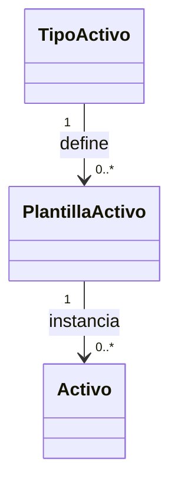

El diagrama representa la estructura conceptual del dominio Inventario.

Los tipos de activos definen las categorías oficiales del inventario. Las plantillas establecen la estructura común para cada categoría y los activos representan las instancias administradas por la organización.

En esta etapa del modelo no se incluyen atributos, operaciones ni restricciones de implementación.

---

## 8.5 Interpretación del Dominio

El dominio Inventario constituye el núcleo de la administración de recursos de GANUS Enterprise Platform.

Su responsabilidad consiste en representar todos los elementos físicos o lógicos que participan en la operación del negocio y que pueden ser administrados, monitoreados, relacionados o utilizados durante la ejecución de procesos empresariales.

Cada activo pertenece a un contexto organizacional definido por una finca y es clasificado mediante un tipo de activo que determina su naturaleza dentro del negocio.

Las plantillas de activos permiten establecer una estructura común para cada categoría de inventario, garantizando consistencia en la información administrada por la plataforma.

Este dominio no ejecuta procesos ni captura información; proporciona la estructura sobre la cual operan los demás dominios del Core Empresarial.

---

## 8.6 Responsabilidades de las Clases

### TipoActivo

**Descripción**

Representa la clasificación oficial utilizada para organizar los activos del negocio.

Cada tipo de activo establece la categoría a la cual pertenecerán los activos registrados dentro de la plataforma.

**Responsabilidades**

- Clasificar los activos.
- Definir categorías oficiales del inventario.
- Servir como base para la creación de plantillas.
- Mantener la organización del inventario empresarial.

---

### PlantillaActivo

**Descripción**

Representa la estructura base utilizada para definir la información común que compartirán los activos pertenecientes a un mismo tipo.

Las plantillas permiten estandarizar el inventario administrado por GANUS.

**Responsabilidades**

- Definir la estructura común de los activos.
- Estandarizar la información del inventario.
- Facilitar la creación de nuevos activos.
- Garantizar consistencia en la información registrada.

---

### Activo

**Descripción**

Representa cualquier elemento físico o lógico perteneciente a la organización que participa en la operación del negocio.

Todo activo existe dentro de una finca y puede ser utilizado por otros dominios de la plataforma.

**Responsabilidades**

- Representar un recurso del negocio.
- Participar en procesos y actividades.
- Servir como contexto para la captura de información.
- Relacionarse con otros activos cuando corresponda.
- Constituir la unidad principal del inventario empresarial.

---

## 8.7 Relaciones con otros Dominios

El dominio Inventario constituye uno de los pilares del Core Empresarial y proporciona la información base utilizada por múltiples dominios de GANUS Enterprise Platform.

Las relaciones conceptuales con los demás dominios son las siguientes:

| Dominio | Relación |
|----------|----------|
| Organización | Todo activo pertenece a una finca dentro de una organización. |
| Field Engine | Los formularios pueden capturar información asociada a un activo. |
| Valores | Los valores registrados pertenecen a un activo específico. |
| Identificación | Los identificadores permiten individualizar cada activo del inventario. |
| Relaciones | Los activos pueden establecer relaciones con otros activos. |
| MAKE | Las actividades se ejecutan sobre uno o varios activos. |
| Knowledge Studio | El conocimiento empresarial utiliza la información proveniente del inventario. |
| Analytics | Los indicadores pueden calcularse utilizando información de los activos. |
| Alertas | Las alertas pueden originarse sobre un activo determinado. |
| Dashboard | Los tableros presentan información consolidada del inventario. |
| Advisory | Las recomendaciones consideran el estado y contexto de los activos. |

El dominio Inventario proporciona el contexto operativo sobre el cual se desarrollan múltiples procesos del negocio.

---

## 8.8 Decisiones Arquitectónicas

Durante el diseño del dominio Inventario se adoptan las siguientes decisiones arquitectónicas:

- Todo elemento administrado por la plataforma que participe en la operación del negocio será representado como un activo.
- La clasificación de los activos se realizará mediante tipos de activo.
- La información común de cada categoría será definida mediante plantillas de activos.
- Los activos constituirán la unidad principal del inventario empresarial.
- El dominio Inventario no administra procesos, reglas, indicadores ni conocimiento empresarial.
- Los demás dominios consumirán la información del inventario sin modificar su responsabilidad dentro del modelo.

Estas decisiones deberán mantenerse consistentes durante la evolución del Core Empresarial.

---

## 8.9 Observaciones

El dominio Inventario representa exclusivamente la administración conceptual de los activos del negocio.

Las características particulares de cada activo serán definidas mediante plantillas y mecanismos de captura de información documentados en el dominio Field Engine.

La ejecución de actividades sobre los activos será documentada en el dominio MAKE.

La incorporación de nuevas clases dentro del dominio Inventario únicamente podrá realizarse cuando exista una modificación oficial del negocio o de la arquitectura empresarial.

Con la aprobación de este dominio se establece el modelo conceptual oficial para la administración del inventario dentro de GANUS Enterprise Platform.

---

# 9. Dominio Field Engine

## 9.1 Objetivo

El dominio **Field Engine** representa el motor de definición y captura de información de GANUS Enterprise Platform.

Su propósito consiste en proporcionar una estructura flexible que permita modelar formularios, definir campos, establecer métodos de captura y controlar la forma en que la información será recolectada durante la operación del negocio.

Este dominio constituye el mecanismo oficial mediante el cual los diferentes módulos de la plataforma obtienen información estructurada y consistente.

---

## 9.2 Alcance

El dominio Field Engine comprende la definición de las estructuras necesarias para construir y publicar formularios reutilizables dentro de la plataforma.

Su alcance incluye:

- Definición de campos.
- Definición de tipos de datos.
- Métodos de captura.
- Catálogos reutilizables.
- Asociación de métodos de captura.
- Publicación de estructuras de captura.

No forma parte del alcance de este dominio:

- La ejecución de actividades.
- El almacenamiento de valores capturados.
- La administración de activos.
- La generación de indicadores.
- Las reglas del negocio.
- La generación de conocimiento empresarial.

Estas responsabilidades pertenecen a otros dominios del modelo.

---

## 9.3 Clases Oficiales

El dominio Field Engine está conformado por las siguientes clases oficiales:

| Clase | Descripción |
|--------|-------------|
| FieldLibrary | Representa la biblioteca oficial de formularios reutilizables. |
| FieldDefinition | Define la estructura de un campo dentro de un formulario. |
| TipoDato | Representa el tipo de información que podrá capturarse en un campo. |
| MetodoCaptura | Define la forma mediante la cual un dato será capturado. |
| FieldCaptureMethod | Representa la asociación entre un campo y uno o varios métodos de captura. |
| CatalogoValor | Representa un catálogo reutilizable de valores utilizado por diferentes formularios. |

Estas clases constituyen el núcleo conceptual del motor de captura de información de GANUS Enterprise Platform.

---

## 9.4 Diagrama UML

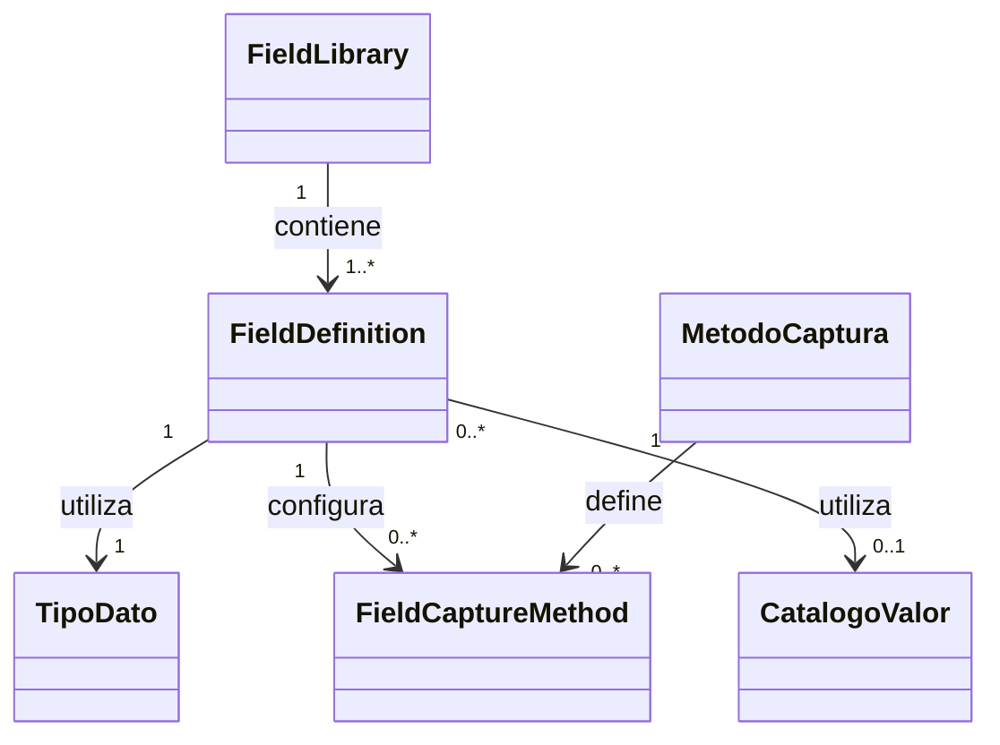

El diagrama representa la estructura conceptual del motor de definición y captura de información.

La biblioteca de formularios agrupa definiciones de campos. Cada campo posee un tipo de dato, puede disponer de uno o varios métodos de captura y, cuando corresponde, utilizar un catálogo reutilizable de valores.

En esta etapa no se representan atributos, operaciones ni restricciones de implementación.

---

## 9.5 Interpretación del Dominio

El dominio Field Engine constituye el mecanismo mediante el cual GANUS Enterprise Platform define la estructura de la información que será capturada durante la operación del negocio.

Su responsabilidad consiste en proporcionar un modelo flexible para construir formularios reutilizables sin depender de estructuras específicas para cada proceso.

Cada formulario está compuesto por un conjunto de definiciones de campos que describen la información requerida, el tipo de dato esperado, el método de captura correspondiente y, cuando aplica, los catálogos reutilizables utilizados durante la captura.

Este dominio no almacena información operacional; únicamente define la estructura mediante la cual dicha información será capturada por otros dominios de la plataforma.

---

## 9.6 Responsabilidades de las Clases

### FieldLibrary

**Descripción**

Representa la biblioteca oficial de formularios reutilizables de GANUS Enterprise Platform.

Agrupa las definiciones de campos utilizadas por los diferentes procesos del negocio.

**Responsabilidades**

- Administrar formularios reutilizables.
- Organizar las definiciones de captura.
- Proporcionar estructuras reutilizables para la operación.
- Centralizar la definición de formularios.

---

### FieldDefinition

**Descripción**

Representa la definición conceptual de un campo dentro de un formulario.

Cada definición establece la información que deberá ser capturada durante un proceso del negocio.

**Responsabilidades**

- Definir un campo del formulario.
- Asociar un tipo de dato.
- Asociar métodos de captura.
- Utilizar catálogos cuando corresponda.

---

### TipoDato

**Descripción**

Representa el tipo de información permitido para un campo.

Su función consiste en garantizar la consistencia del dato esperado durante la captura.

**Responsabilidades**

- Clasificar el tipo de información.
- Estandarizar la captura de datos.
- Restringir el formato esperado para cada campo.

---

### MetodoCaptura

**Descripción**

Representa la forma mediante la cual la plataforma obtiene la información requerida para un campo.

**Responsabilidades**

- Definir mecanismos de captura.
- Estandarizar la obtención de datos.
- Permitir diferentes estrategias de captura.

---

### FieldCaptureMethod

**Descripción**

Representa la asociación entre una definición de campo y los métodos de captura disponibles.

Permite establecer qué mecanismos podrán utilizarse para capturar un determinado dato.

**Responsabilidades**

- Relacionar campos con métodos de captura.
- Permitir configuraciones flexibles.
- Mantener la independencia entre campos y mecanismos de captura.

---

### CatalogoValor

**Descripción**

Representa un conjunto reutilizable de valores utilizados por diferentes formularios.

Los catálogos permiten mantener consistencia en la información seleccionada por los usuarios.

**Responsabilidades**

- Administrar listas reutilizables.
- Centralizar valores comunes.
- Facilitar la reutilización de información.
- Garantizar consistencia entre formularios.

---

## 9.7 Relaciones con otros Dominios

El dominio Field Engine proporciona la estructura utilizada para capturar información en los diferentes procesos de GANUS Enterprise Platform.

Las relaciones conceptuales con los demás dominios son las siguientes:

| Dominio | Relación |
|----------|----------|
| Organización | Los formularios se utilizan dentro de un contexto organizacional definido. |
| Inventario | Los formularios permiten capturar información asociada a los activos. |
| Valores | Los datos capturados generan valores pertenecientes a los activos y procesos. |
| Identificación | Los formularios pueden solicitar identificadores para los activos. |
| Relaciones | Los formularios pueden registrar relaciones entre activos. |
| MAKE | Las actividades utilizan formularios para registrar su ejecución. |
| Knowledge Studio | El conocimiento empresarial utiliza la información capturada por los formularios. |
| Analytics | Los indicadores pueden calcularse utilizando la información capturada. |
| Alertas | Las alertas pueden generarse a partir de los datos registrados. |
| Dashboard | Los tableros presentan información proveniente de los formularios. |
| Advisory | Las recomendaciones utilizan información obtenida mediante el motor de captura. |

El dominio Field Engine constituye el mecanismo oficial de captura de información para el Core Empresarial.

---

## 9.8 Decisiones Arquitectónicas

Durante el diseño del dominio Field Engine se adoptan las siguientes decisiones arquitectónicas:

- La definición de formularios será completamente desacoplada de los procesos del negocio.
- Toda estructura de captura será construida mediante definiciones de campos reutilizables.
- Los tipos de datos establecerán las restricciones conceptuales de cada campo.
- Los métodos de captura determinarán la forma en que la información será obtenida.
- Los catálogos reutilizables evitarán la duplicación de valores comunes.
- El dominio Field Engine no almacena información operacional; únicamente define la estructura para su captura.
- Los demás dominios utilizarán las definiciones generadas por Field Engine sin modificar su responsabilidad dentro del modelo.

Estas decisiones deberán mantenerse consistentes durante la evolución del Core Empresarial.

---

## 9.9 Observaciones

El dominio Field Engine representa exclusivamente el modelo conceptual utilizado para definir la captura de información dentro de GANUS Enterprise Platform.

Los datos registrados mediante formularios serán administrados por los dominios correspondientes, según el contexto del negocio en el que se produzca la captura.

Las capacidades relacionadas con versionado, publicación, renderización, historial y vista previa forman parte del comportamiento funcional de la plataforma y serán documentadas en los artefactos UML correspondientes.

La incorporación de nuevas clases dentro del dominio Field Engine únicamente podrá realizarse cuando exista una modificación oficial del negocio o de la arquitectura empresarial.

Con la aprobación de este dominio se establece el modelo conceptual oficial para la definición y captura de información del Core Empresarial.

---

# 10. Dominio Valores

## 10.1 Objetivo

El dominio **Valores** representa la información capturada durante la operación del negocio mediante las estructuras definidas por Field Engine.

Su propósito consiste en almacenar conceptualmente los valores registrados para los diferentes activos y procesos de GANUS Enterprise Platform, preservando su relación con el contexto organizacional y operativo.

Este dominio constituye el puente entre la definición de formularios y la información efectiva utilizada por los procesos del negocio.

---

## 10.2 Alcance

El dominio Valores comprende la administración conceptual de los datos registrados durante la operación de la plataforma.

Su alcance incluye:

- Registro de valores capturados.
- Asociación de valores con activos.
- Asociación de valores con estructuras de captura.
- Disponibilidad de información para otros dominios.

No forma parte del alcance de este dominio:

- La definición de formularios.
- La administración de activos.
- La ejecución de actividades.
- La generación de indicadores.
- La administración de reglas de negocio.

Estas responsabilidades pertenecen a otros dominios del modelo.

---

## 10.3 Clases Oficiales

El dominio Valores está conformado por la siguiente clase oficial:

| Clase | Descripción |
|--------|-------------|
| ValorActivo | Representa el valor registrado para un activo como resultado de un proceso de captura de información. |

ValorActivo constituye la representación conceptual del dato persistido dentro del modelo del dominio.

---

## 10.4 Diagrama UML

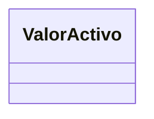

En esta primera versión del modelo, el dominio Valores está representado por una única clase conceptual.

Las relaciones con Inventario y Field Engine serán documentadas posteriormente como parte de la integración entre dominios, evitando introducir dependencias prematuras dentro del modelo conceptual.

---

## 10.5 Interpretación del Dominio

El dominio Valores representa la información obtenida como resultado de la captura realizada durante la operación del negocio.

Cada valor registrado constituye la evidencia conceptual de un dato asociado a un activo dentro de un contexto organizacional determinado.

Este dominio actúa como el vínculo entre las estructuras definidas por Field Engine y la información utilizada por los procesos empresariales, permitiendo que otros dominios consuman datos consistentes y estructurados.

El dominio Valores no define formularios ni administra activos; su responsabilidad consiste exclusivamente en representar los datos registrados durante la operación.

---

## 10.6 Responsabilidades de las Clases

### ValorActivo

**Descripción**

Representa el valor registrado como resultado de un proceso de captura de información asociado a un activo.

Cada valor constituye la representación conceptual de un dato obtenido durante la operación del negocio.

**Responsabilidades**

- Representar información capturada.
- Asociar valores con un activo.
- Mantener la consistencia de la información registrada.
- Proporcionar datos para procesos posteriores.
- Servir como fuente de información para análisis, indicadores y conocimiento empresarial.

---

## 10.7 Relaciones con otros Dominios

El dominio Valores proporciona la información operacional utilizada por diferentes dominios de GANUS Enterprise Platform.

Las relaciones conceptuales con los demás dominios son las siguientes:

| Dominio | Relación |
|----------|----------|
| Organización | Los valores pertenecen a un contexto organizacional definido. |
| Inventario | Cada valor está asociado a un activo del inventario. |
| Field Engine | Los valores son generados mediante las estructuras de captura definidas por Field Engine. |
| Identificación | Los valores pueden asociarse a identificadores de activos cuando corresponda. |
| Relaciones | Los valores pueden intervenir en la definición de relaciones entre activos. |
| MAKE | Las actividades generan valores durante su ejecución. |
| Knowledge Studio | El conocimiento empresarial utiliza los valores registrados para generar análisis e interpretación. |
| Analytics | Los indicadores se calculan utilizando valores registrados. |
| Alertas | Las alertas pueden originarse a partir de determinados valores. |
| Dashboard | Los tableros presentan información consolidada proveniente de los valores registrados. |
| Advisory | Las recomendaciones utilizan los valores registrados como fuente de información. |

El dominio Valores constituye la representación conceptual de la información capturada durante la operación del negocio.

---

## 10.8 Decisiones Arquitectónicas

Durante el diseño del dominio Valores se adoptan las siguientes decisiones arquitectónicas:

- Todo dato capturado será representado mediante un ValorActivo.
- Los valores existirán únicamente como resultado de un proceso de captura.
- Los valores estarán asociados al contexto organizacional correspondiente.
- El dominio Valores no define formularios ni administra activos.
- Los demás dominios consumirán los valores registrados sin modificar su responsabilidad dentro del modelo.

Estas decisiones deberán mantenerse consistentes durante la evolución del Core Empresarial.

---

## 10.9 Observaciones

El dominio Valores representa exclusivamente la información registrada durante la operación del negocio.

La definición de las estructuras de captura corresponde al dominio Field Engine, mientras que la administración de los activos pertenece al dominio Inventario.

Los valores registrados constituyen una de las principales fuentes de información utilizadas por los dominios MAKE, Analytics, Alertas, Dashboard, Advisory y Knowledge Studio.

La incorporación de nuevas clases dentro del dominio Valores únicamente podrá realizarse cuando exista una modificación oficial del negocio o de la arquitectura empresarial.

Con la aprobación de este dominio se establece el modelo conceptual oficial para la representación de la información capturada dentro de GANUS Enterprise Platform.

---

# 11. Dominio Identificación

## 11.1 Objetivo

El dominio **Identificación** representa el mecanismo mediante el cual los activos administrados por GANUS Enterprise Platform pueden ser identificados de manera única dentro del contexto del negocio.

Su propósito consiste en definir los tipos de identificadores permitidos y la asociación de dichos identificadores con los activos registrados en la plataforma.

Este dominio garantiza la trazabilidad e identificación consistente de los recursos administrados por el Core Empresarial.

---

## 11.2 Alcance

El dominio Identificación comprende la administración conceptual de los mecanismos de identificación de activos.

Su alcance incluye:

- Definición de tipos de identificadores.
- Asociación de identificadores con activos.
- Identificación única de recursos del negocio.

No forma parte del alcance de este dominio:

- La administración de activos.
- La captura de información.
- La ejecución de actividades.
- La generación de indicadores.
- La administración de reglas de negocio.

Estas responsabilidades pertenecen a otros dominios del modelo.

---

## 11.3 Clases Oficiales

El dominio Identificación está conformado por las siguientes clases oficiales:

| Clase | Descripción |
|--------|-------------|
| TipoIdentificador | Representa la clasificación de los mecanismos utilizados para identificar activos dentro de la plataforma. |
| IdentificadorActivo | Representa la identificación asignada a un activo específico. |

Estas clases constituyen el núcleo conceptual del dominio Identificación y permiten mantener la trazabilidad de los activos administrados por GANUS Enterprise Platform.

---

## 11.4 Diagrama UML

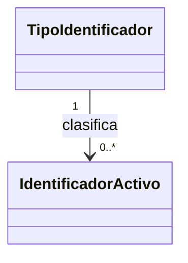

El diagrama representa la estructura conceptual del dominio Identificación.

Los tipos de identificador definen las categorías permitidas para identificar activos, mientras que los identificadores representan las instancias utilizadas durante la operación del negocio.

En esta etapa del modelo no se incluyen atributos, operaciones ni restricciones de implementación.

---

## 11.5 Interpretación del Dominio

El dominio Identificación representa el mecanismo conceptual mediante el cual los activos pueden ser identificados de forma única dentro de GANUS Enterprise Platform.

Su propósito consiste en garantizar la trazabilidad de los recursos administrados por la plataforma mediante identificadores asociados a un tipo de identificación previamente definido.

Este dominio permite desacoplar la identidad de un activo de sus características propias, facilitando la administración de diferentes esquemas de identificación según las necesidades del negocio.

La responsabilidad de este dominio se limita a la identificación conceptual de los activos y no comprende su administración ni la captura de información operacional.

---

## 11.6 Responsabilidades de las Clases

### TipoIdentificador

**Descripción**

Representa la clasificación oficial utilizada para definir los diferentes mecanismos de identificación disponibles dentro de la plataforma.

**Responsabilidades**

- Clasificar los mecanismos de identificación.
- Definir categorías de identificadores.
- Estandarizar los esquemas de identificación utilizados por la organización.
- Servir como referencia para la asignación de identificadores a los activos.

---

### IdentificadorActivo

**Descripción**

Representa la identificación asignada a un activo específico dentro del contexto organizacional.

Cada identificador permite distinguir un activo de los demás recursos administrados por la plataforma.

**Responsabilidades**

- Identificar un activo de forma única.
- Mantener la trazabilidad del recurso identificado.
- Asociar un identificador con un tipo de identificación.
- Facilitar la consulta y localización de activos.

---

## 11.7 Relaciones con otros Dominios

El dominio Identificación proporciona el mecanismo de identificación utilizado por los diferentes dominios de GANUS Enterprise Platform.

Las relaciones conceptuales con los demás dominios son las siguientes:

| Dominio | Relación |
|----------|----------|
| Organización | Los identificadores pertenecen a un contexto organizacional definido. |
| Inventario | Cada identificador está asociado a un activo del inventario. |
| Field Engine | Los formularios pueden solicitar identificadores durante la captura de información. |
| Valores | Los valores registrados pueden asociarse a identificadores de activos. |
| Relaciones | Los identificadores facilitan la asociación entre activos relacionados. |
| MAKE | Las actividades pueden ejecutarse sobre activos identificados. |
| Knowledge Studio | El conocimiento empresarial utiliza identificadores para mantener la trazabilidad de los activos. |
| Analytics | Los indicadores pueden agrupar información utilizando identificadores. |
| Alertas | Las alertas pueden asociarse a activos identificados. |
| Dashboard | Los tableros presentan información relacionada con activos identificados. |
| Advisory | Las recomendaciones consideran la identificación de los activos involucrados. |

El dominio Identificación garantiza la trazabilidad conceptual de los recursos administrados por el Core Empresarial.

---

## 11.8 Decisiones Arquitectónicas

Durante el diseño del dominio Identificación se adoptan las siguientes decisiones arquitectónicas:

- Todo activo podrá disponer de uno o varios identificadores según las reglas del negocio.
- La clasificación de los identificadores será administrada mediante tipos de identificador.
- La identificación constituye un dominio independiente del inventario.
- Los identificadores permitirán mantener la trazabilidad de los recursos administrados por la plataforma.
- Los demás dominios utilizarán los mecanismos de identificación sin modificar su responsabilidad dentro del modelo.

Estas decisiones deberán mantenerse consistentes durante la evolución del Core Empresarial.

---

## 11.9 Observaciones

El dominio Identificación representa exclusivamente el modelo conceptual utilizado para identificar los activos administrados por GANUS Enterprise Platform.

La administración de los activos corresponde al dominio Inventario, mientras que la captura de información pertenece al dominio Field Engine.

Los identificadores proporcionan un mecanismo uniforme para garantizar la trazabilidad de los recursos utilizados por los diferentes dominios del Core Empresarial.

La incorporación de nuevas clases dentro del dominio Identificación únicamente podrá realizarse cuando exista una modificación oficial del negocio o de la arquitectura empresarial.

Con la aprobación de este dominio se establece el modelo conceptual oficial para la identificación de activos dentro de GANUS Enterprise Platform.

---

# 12. Dominio Relaciones

## 12.1 Objetivo

El dominio **Relaciones** representa el conjunto de asociaciones conceptuales que pueden establecerse entre los activos administrados por GANUS Enterprise Platform.

Su propósito consiste en definir los tipos de relaciones permitidas y representar los vínculos existentes entre los diferentes activos que participan en la operación del negocio.

Este dominio permite modelar la estructura relacional del negocio de forma independiente de la administración de los activos y de la captura de información.

---

## 12.2 Alcance

El dominio Relaciones comprende la administración conceptual de las relaciones existentes entre los activos del negocio.

Su alcance incluye:

- Definición de tipos de relación.
- Asociación entre activos.
- Representación de vínculos conceptuales del negocio.

No forma parte del alcance de este dominio:

- La administración de activos.
- La captura de información.
- La ejecución de actividades.
- La generación de indicadores.
- La administración de reglas de negocio.

Estas responsabilidades pertenecen a otros dominios del modelo.

---

## 12.3 Clases Oficiales

El dominio Relaciones está conformado por las siguientes clases oficiales:

| Clase | Descripción |
|--------|-------------|
| TipoRelacion | Representa la clasificación oficial de las relaciones permitidas entre activos. |
| RelacionActivo | Representa la asociación establecida entre dos o más activos dentro del contexto del negocio. |

Estas clases constituyen el núcleo conceptual del dominio Relaciones y permiten representar la estructura relacional de los activos administrados por GANUS Enterprise Platform.

---

## 12.4 Diagrama UML

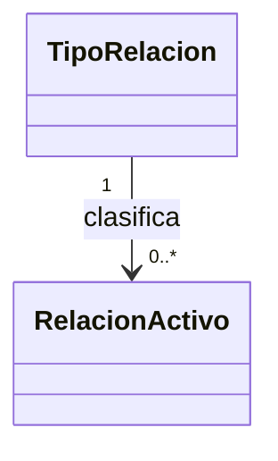

El diagrama representa la estructura conceptual del dominio Relaciones.

Los tipos de relación establecen las categorías oficiales utilizadas por el negocio, mientras que las relaciones representan las asociaciones existentes entre los activos administrados por la plataforma.

En esta etapa del modelo no se incluyen atributos, operaciones ni restricciones de implementación.

---

## 12.5 Interpretación del Dominio

El dominio Relaciones representa la estructura conceptual mediante la cual los activos administrados por GANUS Enterprise Platform pueden establecer vínculos entre sí.

Su propósito consiste en permitir que el modelo del negocio represente asociaciones existentes entre los diferentes recursos administrados por la organización, independientemente de su naturaleza.

Las relaciones permiten construir una visión integrada del negocio, facilitando la navegación entre activos, la trazabilidad de la operación y la comprensión de las dependencias existentes dentro del Core Empresarial.

Este dominio no administra los activos ni define su estructura; únicamente representa las asociaciones conceptuales existentes entre ellos.

---

## 12.6 Responsabilidades de las Clases

### TipoRelacion

**Descripción**

Representa la clasificación oficial utilizada para definir las diferentes relaciones permitidas entre los activos del negocio.

**Responsabilidades**

- Clasificar las relaciones del negocio.
- Definir categorías oficiales de asociación.
- Estandarizar los vínculos permitidos entre activos.
- Servir como referencia para la creación de relaciones.

---

### RelacionActivo

**Descripción**

Representa una asociación conceptual establecida entre dos o más activos pertenecientes al negocio.

Cada relación permite representar vínculos relevantes para la operación empresarial.

**Responsabilidades**

- Representar asociaciones entre activos.
- Mantener la trazabilidad de los vínculos del negocio.
- Relacionar activos pertenecientes al inventario.
- Facilitar la navegación conceptual entre recursos.

---

## 12.7 Relaciones con otros Dominios

El dominio Relaciones proporciona el mecanismo mediante el cual los activos administrados por GANUS Enterprise Platform pueden asociarse conceptualmente.

Las relaciones con los demás dominios son las siguientes:

| Dominio | Relación |
|----------|----------|
| Organización | Las relaciones se establecen dentro de un contexto organizacional definido. |
| Inventario | Las relaciones vinculan activos pertenecientes al inventario. |
| Field Engine | Los formularios pueden registrar relaciones entre activos durante la captura de información. |
| Valores | Los valores registrados pueden utilizarse para describir relaciones existentes. |
| Identificación | Los identificadores permiten reconocer los activos involucrados en una relación. |
| MAKE | Las actividades pueden involucrar activos previamente relacionados. |
| Knowledge Studio | El conocimiento empresarial utiliza las relaciones para comprender la estructura del negocio. |
| Analytics | Los indicadores pueden analizar información derivada de las relaciones entre activos. |
| Alertas | Las alertas pueden generarse considerando relaciones existentes entre recursos. |
| Dashboard | Los tableros presentan información basada en las relaciones del negocio. |
| Advisory | Las recomendaciones consideran las asociaciones existentes entre los activos. |

El dominio Relaciones proporciona una representación conceptual de las asociaciones utilizadas por el Core Empresarial.

---

## 12.8 Decisiones Arquitectónicas

Durante el diseño del dominio Relaciones se adoptan las siguientes decisiones arquitectónicas:

- Las relaciones constituyen un dominio independiente del inventario.
- Todo vínculo entre activos será representado mediante una relación conceptual.
- Los tipos de relación definirán las categorías oficiales utilizadas por el negocio.
- Las relaciones no modifican la identidad ni la estructura de los activos.
- Los demás dominios utilizarán las relaciones como mecanismo de navegación y trazabilidad dentro del Core Empresarial.

Estas decisiones deberán mantenerse consistentes durante la evolución del modelo del dominio.

---

## 12.9 Observaciones

El dominio Relaciones representa exclusivamente las asociaciones conceptuales existentes entre los activos administrados por GANUS Enterprise Platform.

La administración de los activos pertenece al dominio Inventario, mientras que la identificación de los recursos corresponde al dominio Identificación.

Las relaciones constituyen un mecanismo transversal utilizado por múltiples dominios del Core Empresarial para representar dependencias y asociaciones del negocio.

La incorporación de nuevas clases dentro del dominio Relaciones únicamente podrá realizarse cuando exista una modificación oficial del negocio o de la arquitectura empresarial.

Con la aprobación de este dominio se establece el modelo conceptual oficial para la representación de las relaciones entre activos dentro de GANUS Enterprise Platform.

---

# 13. Dominio MAKE

## 13.1 Objetivo

El dominio **MAKE** representa la ejecución de las actividades operativas administradas por GANUS Enterprise Platform.

Su propósito consiste en modelar las actividades que se realizan sobre los activos del negocio, la información capturada durante su ejecución y las evidencias generadas como resultado de dichos procesos.

Este dominio constituye el núcleo operativo del Core Empresarial, ya que integra los diferentes componentes definidos en los dominios anteriores para soportar la ejecución de los procesos del negocio.

---

## 13.2 Alcance

El dominio MAKE comprende la administración conceptual de las actividades ejecutadas dentro de la plataforma.

Su alcance incluye:

- Definición de tipos de actividades.
- Definición de plantillas de actividades.
- Ejecución de actividades.
- Asociación de actividades con activos.
- Registro de información generada durante la actividad.
- Administración conceptual de evidencias.

No forma parte del alcance de este dominio:

- La administración del inventario.
- La definición de formularios.
- La generación de indicadores.
- La administración de reglas de negocio.
- La generación de conocimiento empresarial.

Estas responsabilidades pertenecen a otros dominios del modelo.

---

## 13.3 Clases Oficiales

El dominio MAKE está conformado por las siguientes clases oficiales:

| Clase | Descripción |
|--------|-------------|
| TipoActividad | Representa la clasificación oficial de las actividades del negocio. |
| PlantillaActividad | Define la estructura utilizada para ejecutar una actividad. |
| Actividad | Representa la ejecución de una actividad dentro del negocio. |
| ActividadActivo | Representa la asociación entre una actividad y los activos involucrados. |
| ActividadDato | Representa la información registrada durante la ejecución de una actividad. |
| Evidencia | Representa la evidencia generada como resultado de una actividad. |

Estas clases constituyen el núcleo conceptual del dominio MAKE y representan la operación empresarial administrada por GANUS Enterprise Platform.

---

## 13.4 Diagrama UML

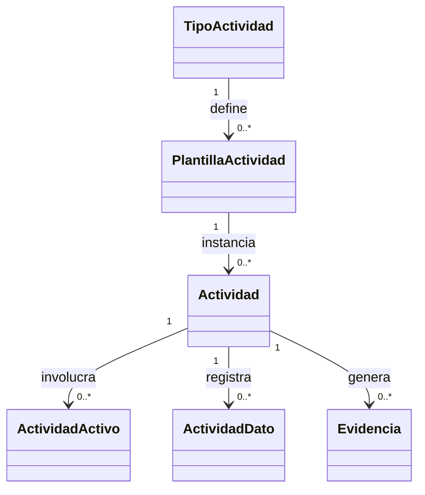

El diagrama representa la estructura conceptual del dominio MAKE.

Las actividades constituyen el eje central de la operación del negocio. Cada actividad se ejecuta a partir de una plantilla previamente definida, puede involucrar uno o varios activos, registrar información durante su ejecución y generar evidencias como resultado del proceso.

En esta etapa del modelo no se representan atributos, operaciones ni detalles de implementación.

---

## 13.5 Interpretación del Dominio

El dominio MAKE representa el conjunto de procesos operativos ejecutados sobre los activos administrados por GANUS Enterprise Platform.

Su propósito consiste en coordinar la ejecución de actividades del negocio utilizando las estructuras definidas por los dominios Organización, Inventario, Field Engine, Valores, Identificación y Relaciones.

Cada actividad constituye una unidad operacional del negocio y puede involucrar uno o varios activos, registrar información durante su ejecución y producir evidencias que soportan la trazabilidad de los procesos.

Este dominio representa el núcleo operativo del Core Empresarial y constituye el punto de integración de los diferentes dominios funcionales de la plataforma.

---

## 13.6 Responsabilidades de las Clases

### TipoActividad

**Descripción**

Representa la clasificación oficial utilizada para organizar las actividades del negocio.

**Responsabilidades**

- Clasificar las actividades.
- Definir categorías operativas.
- Servir como base para las plantillas de actividades.

---

### PlantillaActividad

**Descripción**

Representa la estructura conceptual utilizada para definir la ejecución de una actividad.

**Responsabilidades**

- Definir la estructura de una actividad.
- Estandarizar la ejecución de procesos.
- Facilitar la reutilización de actividades.

---

### Actividad

**Descripción**

Representa la ejecución de una actividad dentro del contexto del negocio.

**Responsabilidades**

- Representar una ejecución operacional.
- Coordinar la captura de información.
- Asociar activos participantes.
- Generar evidencias del proceso.

---

### ActividadActivo

**Descripción**

Representa la asociación entre una actividad y los activos involucrados durante su ejecución.

**Responsabilidades**

- Relacionar actividades con activos.
- Mantener la trazabilidad operacional.
- Registrar la participación de los recursos del negocio.

---

### ActividadDato

**Descripción**

Representa la información registrada durante la ejecución de una actividad.

**Responsabilidades**

- Representar datos generados por la actividad.
- Asociar información con la ejecución operacional.
- Facilitar el procesamiento posterior de los datos.

---

### Evidencia

**Descripción**

Representa la evidencia generada durante o como resultado de la ejecución de una actividad.

**Responsabilidades**

- Representar evidencias del proceso.
- Mantener soporte documental de la operación.
- Facilitar la trazabilidad del negocio.

---

## 13.7 Relaciones con otros Dominios

El dominio MAKE constituye el núcleo operativo de GANUS Enterprise Platform y se integra con los demás dominios del Core Empresarial.

Las relaciones conceptuales son las siguientes:

| Dominio | Relación |
|----------|----------|
| Organización | Las actividades se ejecutan dentro de una organización y una finca. |
| Inventario | Las actividades involucran uno o varios activos. |
| Field Engine | Las actividades utilizan formularios para capturar información. |
| Valores | La ejecución de actividades genera valores registrados. |
| Identificación | Los activos participantes pueden identificarse mediante identificadores. |
| Relaciones | Las actividades pueden involucrar activos previamente relacionados. |
| Knowledge Studio | El conocimiento empresarial utiliza la información generada por las actividades. |
| Analytics | Los indicadores utilizan la información producida por las actividades. |
| Alertas | Las actividades pueden originar alertas operativas. |
| Dashboard | Los tableros presentan información derivada de las actividades. |
| Advisory | Las recomendaciones consideran el historial y resultados de las actividades. |

El dominio MAKE representa el punto de integración operacional del Core Empresarial.

---

## 13.8 Decisiones Arquitectónicas

Durante el diseño del dominio MAKE se adoptan las siguientes decisiones arquitectónicas:

- Toda operación del negocio será representada mediante una actividad.
- Las actividades se ejecutarán utilizando plantillas previamente definidas.
- Las actividades podrán involucrar uno o varios activos.
- La información registrada durante la ejecución pertenecerá al dominio Valores.
- Las evidencias constituirán el soporte conceptual de la ejecución operacional.
- El dominio MAKE actuará como núcleo operativo del Core Empresarial.

Estas decisiones deberán mantenerse consistentes durante la evolución del modelo del dominio.

---

## 13.9 Observaciones

El dominio MAKE representa exclusivamente el modelo conceptual de ejecución de actividades dentro de GANUS Enterprise Platform.

La administración de activos corresponde al dominio Inventario, la definición de estructuras de captura pertenece al dominio Field Engine y la información registrada durante la ejecución corresponde al dominio Valores.

Las actividades constituyen el principal mecanismo mediante el cual la plataforma soporta la operación del negocio y generan la información utilizada posteriormente por Knowledge Studio, Analytics, Alertas, Dashboard y Advisory.

La incorporación de nuevas clases dentro del dominio MAKE únicamente podrá realizarse cuando exista una modificación oficial del negocio o de la arquitectura empresarial.

Con la aprobación de este dominio se establece el modelo conceptual oficial para la ejecución de procesos operativos dentro del Core Empresarial.

---

# 14. Knowledge Studio

## 14.1 Objetivo

El dominio **Knowledge Studio** representa el conjunto de elementos utilizados para construir el conocimiento empresarial de GANUS Enterprise Platform.

Su propósito consiste en modelar las reglas del negocio que interpretan la información generada durante la operación, permitiendo transformar datos en conocimiento reutilizable para apoyar la toma de decisiones.

Este dominio constituye el núcleo del Business Understanding Engine y proporciona la base conceptual para Analytics, Alertas y Advisory.

---

## 14.2 Alcance

El dominio Knowledge Studio comprende la administración conceptual de las reglas del negocio utilizadas para generar conocimiento empresarial.

Su alcance incluye:

- Definición de reglas del negocio.
- Definición de condiciones.
- Definición de acciones.
- Organización del conocimiento empresarial.

No forma parte del alcance de este dominio:

- La ejecución de actividades.
- La captura de información.
- La administración de activos.
- La generación de indicadores.
- La presentación de información.

Estas responsabilidades pertenecen a otros dominios del modelo.

---

## 14.3 Clases Oficiales

El dominio Knowledge Studio está conformado por las siguientes clases oficiales:

| Clase | Descripción |
|--------|-------------|
| ReglaNegocio | Representa una regla oficial utilizada para interpretar la información del negocio. |
| ReglaCondicion | Representa las condiciones necesarias para la evaluación de una regla del negocio. |
| ReglaAccion | Representa las acciones derivadas del cumplimiento de una regla del negocio. |

Estas clases constituyen el núcleo conceptual del conocimiento empresarial administrado por GANUS Enterprise Platform.

---

## 14.4 Diagrama UML

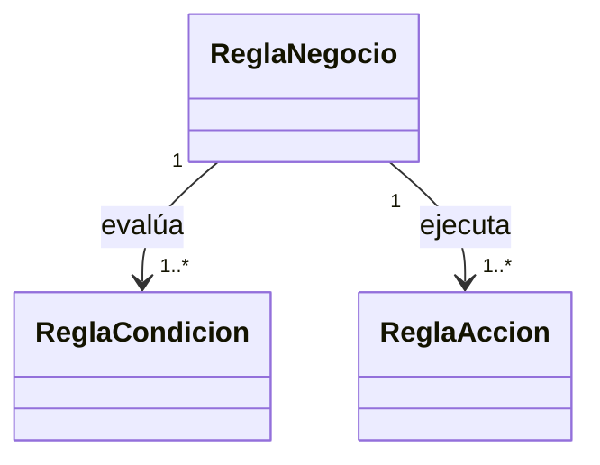

El diagrama representa la estructura conceptual del dominio Knowledge Studio.

Las reglas del negocio agrupan las condiciones necesarias para evaluar una situación empresarial y las acciones conceptuales que podrán ejecutarse como resultado de dicha evaluación.

En esta etapa del modelo no se representan atributos, operaciones ni detalles de implementación.

---

## 14.5 Interpretación del Dominio

El dominio Knowledge Studio representa el núcleo del conocimiento empresarial de GANUS Enterprise Platform.

Su responsabilidad consiste en transformar la información obtenida durante la operación del negocio en conocimiento reutilizable mediante la aplicación de reglas empresariales.

Las reglas permiten interpretar situaciones del negocio, evaluar condiciones específicas y determinar las acciones conceptuales que servirán como base para la generación de resultados, indicadores, alertas y recomendaciones.

Este dominio constituye el Business Understanding Engine del Core Empresarial y representa el punto de transición entre la operación del negocio y la inteligencia empresarial.

---

## 14.6 Responsabilidades de las Clases

### ReglaNegocio

**Descripción**

Representa una regla oficial del negocio utilizada para interpretar información empresarial.

Cada regla constituye una unidad de conocimiento reutilizable dentro del Core Empresarial.

**Responsabilidades**

- Representar una regla del negocio.
- Coordinar la evaluación de condiciones.
- Asociar acciones derivadas de la evaluación.
- Organizar conocimiento reutilizable.

---

### ReglaCondicion

**Descripción**

Representa una condición que debe evaluarse para determinar el comportamiento de una regla del negocio.

**Responsabilidades**

- Representar condiciones empresariales.
- Permitir la evaluación de situaciones del negocio.
- Servir como criterio para la aplicación de reglas.

---

### ReglaAccion

**Descripción**

Representa la acción conceptual derivada del cumplimiento de una regla del negocio.

**Responsabilidades**

- Representar acciones del conocimiento empresarial.
- Definir el resultado conceptual de una regla.
- Servir como base para procesos posteriores del Core Empresarial.

---

## 14.7 Relaciones con otros Dominios

El dominio Knowledge Studio constituye el núcleo de inteligencia empresarial de GANUS Enterprise Platform.

Las relaciones conceptuales con los demás dominios son las siguientes:

| Dominio | Relación |
|----------|----------|
| Organización | Las reglas consideran el contexto organizacional del negocio. |
| Inventario | Las reglas interpretan información asociada a los activos. |
| Field Engine | Las reglas utilizan información obtenida mediante formularios. |
| Valores | Los valores registrados constituyen la principal fuente de información para las reglas. |
| Identificación | Las reglas pueden evaluar activos identificados. |
| Relaciones | Las reglas consideran las relaciones existentes entre los activos. |
| MAKE | Las actividades generan la información utilizada por las reglas. |
| Analytics | Los indicadores utilizan el conocimiento generado por las reglas. |
| Alertas | Las alertas pueden originarse como resultado de la evaluación de reglas. |
| Dashboard | Los tableros presentan resultados derivados del conocimiento empresarial. |
| Advisory | Las recomendaciones utilizan el conocimiento producido por las reglas. |

Knowledge Studio constituye el centro de generación de conocimiento del Core Empresarial.

---

## 14.8 Decisiones Arquitectónicas

Durante el diseño del dominio Knowledge Studio se adoptan las siguientes decisiones arquitectónicas:

- El conocimiento empresarial será representado mediante reglas del negocio.
- Toda regla estará compuesta por condiciones y acciones conceptuales.
- Las reglas serán independientes de la implementación tecnológica.
- El conocimiento empresarial reutilizará información proveniente de los dominios operativos.
- Knowledge Studio constituirá el núcleo del Business Understanding Engine.
- Analytics, Alertas y Advisory consumirán el conocimiento generado por este dominio.

Estas decisiones deberán mantenerse consistentes durante la evolución del Core Empresarial.

---

## 14.9 Observaciones

El dominio Knowledge Studio representa exclusivamente el modelo conceptual utilizado para generar conocimiento empresarial dentro de GANUS Enterprise Platform.

La ejecución operativa corresponde al dominio MAKE, mientras que la información utilizada por las reglas proviene de los dominios Inventario, Field Engine, Valores, Identificación y Relaciones.

Los resultados derivados de este dominio serán consumidos por Analytics, Alertas, Dashboard y Advisory para apoyar la toma de decisiones empresariales.

La incorporación de nuevas clases dentro del dominio Knowledge Studio únicamente podrá realizarse cuando exista una modificación oficial del negocio o de la arquitectura empresarial.

Con la aprobación de este dominio se establece el modelo conceptual oficial del Business Understanding Engine dentro del Core Empresarial.

---

# 15. Analytics

## 15.1 Objetivo

El dominio **Analytics** representa el conjunto de elementos utilizados para analizar el comportamiento del negocio mediante indicadores empresariales.

Su propósito consiste en transformar el conocimiento generado por Knowledge Studio en información cuantificable que permita medir el desempeño de la operación, apoyar la toma de decisiones y realizar seguimiento a los objetivos del negocio.

Este dominio constituye el mecanismo oficial de medición del Core Empresarial.

---

## 15.2 Alcance

El dominio Analytics comprende la administración conceptual de los indicadores utilizados por GANUS Enterprise Platform.

Su alcance incluye:

- Definición de indicadores.
- Generación de resultados de indicadores.
- Organización de métricas empresariales.
- Disponibilidad de información para procesos estratégicos.

No forma parte del alcance de este dominio:

- La captura de información.
- La administración de activos.
- La ejecución de actividades.
- La definición de reglas del negocio.
- La presentación gráfica de resultados.

Estas responsabilidades pertenecen a otros dominios del modelo.

---

## 15.3 Clases Oficiales

El dominio Analytics está conformado por las siguientes clases oficiales:

| Clase | Descripción |
|--------|-------------|
| Indicador | Representa una métrica oficial utilizada para evaluar el desempeño del negocio. |
| IndicadorValor | Representa el resultado conceptual obtenido para un indicador dentro de un contexto determinado. |

Estas clases constituyen el núcleo conceptual del dominio Analytics y permiten representar la medición empresarial dentro de GANUS Enterprise Platform.

---

## 15.4 Diagrama UML

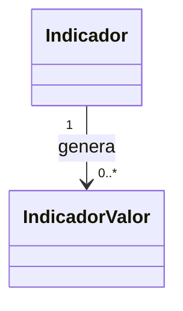

El diagrama representa la estructura conceptual del dominio Analytics.

Cada indicador puede producir múltiples resultados a lo largo del tiempo, permitiendo representar la evolución de las métricas empresariales.

En esta etapa del modelo no se incluyen atributos, operaciones ni detalles de implementación.

---

## 15.5 Interpretación del Dominio

El dominio Analytics representa el mecanismo conceptual mediante el cual GANUS Enterprise Platform mide el comportamiento del negocio utilizando indicadores empresariales.

Su responsabilidad consiste en transformar el conocimiento generado por los procesos operativos y por Knowledge Studio en métricas cuantificables que permitan evaluar el desempeño de la organización, realizar seguimiento a los objetivos estratégicos y apoyar la toma de decisiones.

Cada indicador representa un criterio oficial de medición definido por el negocio y puede generar múltiples resultados a lo largo del tiempo, permitiendo analizar tendencias, comparar periodos y evaluar la evolución de la operación.

Este dominio no interpreta reglas de negocio ni presenta información al usuario; su responsabilidad consiste exclusivamente en representar conceptualmente las métricas y los resultados derivados de su evaluación.

---

## 15.6 Responsabilidades de las Clases

### Indicador

**Descripción**

Representa una métrica oficial utilizada para evaluar el desempeño de un proceso, un activo o cualquier aspecto relevante del negocio.

Cada indicador constituye un mecanismo de medición reutilizable dentro de GANUS Enterprise Platform.

**Responsabilidades**

- Representar una métrica empresarial.
- Definir criterios oficiales de medición.
- Servir como base para el cálculo de resultados.
- Apoyar el seguimiento de objetivos del negocio.

---

### IndicadorValor

**Descripción**

Representa el resultado obtenido como consecuencia de la evaluación de un indicador dentro de un contexto determinado.

Cada resultado refleja el comportamiento medido por un indicador en un momento específico.

**Responsabilidades**

- Representar el resultado de un indicador.
- Registrar mediciones del negocio.
- Facilitar el análisis de tendencias.
- Proporcionar información para procesos estratégicos.

---

## 15.7 Relaciones con otros Dominios

El dominio Analytics consume información proveniente de los dominios operativos y del conocimiento empresarial para producir indicadores que apoyan la toma de decisiones dentro de GANUS Enterprise Platform.

Las relaciones conceptuales con los demás dominios son las siguientes:

| Dominio | Relación |
|----------|----------|
| Organización | Los indicadores se calculan dentro del contexto organizacional definido por la empresa y la finca. |
| Inventario | Los indicadores utilizan información asociada a los activos del inventario. |
| Field Engine | Los indicadores pueden utilizar información capturada mediante formularios. |
| Valores | Los valores registrados constituyen una fuente principal para el cálculo de indicadores. |
| Identificación | Los indicadores pueden agrupar resultados utilizando identificadores de activos. |
| Relaciones | Los indicadores pueden analizar información derivada de las relaciones existentes entre activos. |
| MAKE | Las actividades generan la información utilizada para el cálculo de indicadores. |
| Knowledge Studio | Analytics utiliza el conocimiento empresarial como base para la generación de métricas. |
| Alertas | Los indicadores pueden originar alertas cuando se detectan condiciones relevantes para el negocio. |
| Dashboard | Los resultados de los indicadores son presentados mediante los tableros de información. |
| Advisory | Las recomendaciones consideran el comportamiento de los indicadores empresariales. |

El dominio Analytics constituye el mecanismo oficial de medición del Core Empresarial y proporciona información cuantificable para los procesos estratégicos de GANUS Enterprise Platform.

---

## 15.8 Decisiones Arquitectónicas

Durante el diseño del dominio Analytics se adoptan las siguientes decisiones arquitectónicas:

- Toda medición empresarial será representada mediante un indicador.
- Cada indicador podrá generar múltiples resultados a lo largo del tiempo.
- Los indicadores utilizarán información proveniente de los dominios operativos y del conocimiento empresarial.
- Analytics no ejecuta procesos operativos ni administra información capturada.
- Los resultados generados por Analytics podrán ser utilizados por Dashboard, Alertas y Advisory.
- El dominio Analytics constituye el mecanismo oficial de medición del Core Empresarial.

Estas decisiones deberán mantenerse consistentes durante la evolución del modelo del dominio.

---

## 15.9 Observaciones

El dominio Analytics representa exclusivamente el modelo conceptual utilizado para medir el desempeño del negocio dentro de GANUS Enterprise Platform.

La generación de información operacional corresponde a los dominios Organización, Inventario, Field Engine, Valores, Identificación, Relaciones y MAKE, mientras que la interpretación del negocio pertenece a Knowledge Studio.

Los resultados obtenidos mediante Analytics constituyen una de las principales fuentes de información para Dashboard, Alertas y Advisory.

La incorporación de nuevas clases dentro del dominio Analytics únicamente podrá realizarse cuando exista una modificación oficial del negocio o de la arquitectura empresarial.

Con la aprobación de este dominio se establece el modelo conceptual oficial para la medición empresarial dentro del Core Empresarial.

---

# 16. Dominio Alertas

## 16.1 Objetivo

El dominio **Alertas** representa el mecanismo conceptual utilizado por GANUS Enterprise Platform para identificar situaciones relevantes del negocio que requieren atención por parte de los usuarios o de otros procesos del Core Empresarial.

Su propósito consiste en modelar las alertas generadas a partir de eventos, reglas, indicadores o condiciones operativas, permitiendo notificar oportunamente situaciones que puedan afectar la operación del negocio.

Este dominio constituye el mecanismo oficial de notificación inteligente de la plataforma y complementa los procesos de análisis y toma de decisiones.

---

## 16.2 Alcance

El dominio Alertas comprende la administración conceptual de las alertas generadas dentro de la plataforma.

Su alcance incluye:

- Definición de tipos de alertas.
- Generación conceptual de alertas.
- Clasificación de alertas.
- Disponibilidad de alertas para otros dominios.

No forma parte del alcance de este dominio:

- La ejecución de actividades.
- La captura de información.
- La administración de activos.
- La definición de reglas del negocio.
- La presentación gráfica de alertas.

Estas responsabilidades pertenecen a otros dominios del modelo.

---

## 16.3 Clases Oficiales

El dominio Alertas está conformado por las siguientes clases oficiales:

| Clase | Descripción |
|--------|-------------|
| TipoAlerta | Representa la clasificación oficial utilizada para organizar las alertas del negocio. |
| Alerta | Representa una situación relevante detectada por la plataforma que requiere atención dentro del contexto empresarial. |

Estas clases constituyen el núcleo conceptual del dominio Alertas y permiten representar los eventos relevantes generados durante la operación de GANUS Enterprise Platform.

---

## 16.4 Diagrama UML

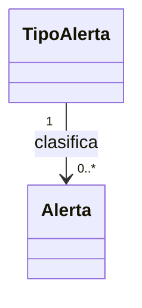

El diagrama representa la estructura conceptual del dominio Alertas.

Los tipos de alerta establecen las categorías oficiales utilizadas por la plataforma, mientras que las alertas representan las situaciones relevantes detectadas durante la operación del negocio.

En esta etapa del modelo no se incluyen atributos, operaciones ni detalles de implementación.

---

## 16.5 Interpretación del Dominio

El dominio Alertas representa el mecanismo conceptual mediante el cual GANUS Enterprise Platform identifica situaciones relevantes que requieren atención durante la operación del negocio.

Su responsabilidad consiste en representar los eventos detectados como consecuencia de la evaluación de reglas, indicadores, actividades o información registrada dentro de la plataforma.

Las alertas permiten informar oportunamente condiciones que pueden afectar la operación, facilitar el seguimiento de situaciones críticas y apoyar la toma de decisiones por parte de los usuarios y de otros componentes del Core Empresarial.

Este dominio no ejecuta acciones correctivas ni interpreta reglas del negocio; únicamente representa conceptualmente las situaciones relevantes detectadas durante la operación.

## 16.6 Responsabilidades de las Clases

### TipoAlerta

**Descripción**

Representa la clasificación oficial utilizada para organizar las diferentes categorías de alertas administradas por la plataforma.

**Responsabilidades**

- Clasificar las alertas.
- Definir categorías oficiales.
- Estandarizar la organización de las alertas.
- Servir como referencia para la generación de alertas.

---

### Alerta

**Descripción**

Representa una situación relevante detectada durante la operación del negocio que requiere atención por parte de los usuarios o de otros procesos del Core Empresarial.

**Responsabilidades**

- Representar una situación relevante.
- Facilitar la notificación de eventos.
- Mantener la trazabilidad de las alertas generadas.
- Servir como fuente de información para procesos de seguimiento y decisión.

## 16.7 Relaciones con otros Dominios

El dominio Alertas consume información proveniente de los dominios operativos, del conocimiento empresarial y de los procesos analíticos para representar situaciones relevantes que requieren atención dentro de GANUS Enterprise Platform.

Las relaciones conceptuales con los demás dominios son las siguientes:

| Dominio | Relación |
|----------|----------|
| Organización | Las alertas pertenecen al contexto organizacional de una empresa y una finca. |
| Inventario | Las alertas pueden asociarse a uno o varios activos del inventario. |
| Field Engine | Las alertas pueden originarse a partir de información capturada mediante formularios. |
| Valores | Los valores registrados pueden generar alertas cuando representan situaciones relevantes. |
| Identificación | Las alertas pueden asociarse a activos identificados dentro del negocio. |
| Relaciones | Las alertas pueden involucrar activos relacionados entre sí. |
| MAKE | Las actividades pueden generar alertas durante su ejecución. |
| Knowledge Studio | Las reglas del negocio pueden producir alertas como resultado de su evaluación. |
| Analytics | Los indicadores pueden originar alertas cuando se detectan condiciones previamente definidas. |
| Dashboard | Los tableros presentan las alertas generadas por la plataforma. |
| Advisory | Las recomendaciones consideran las alertas detectadas para proponer acciones de apoyo al negocio. |

El dominio Alertas constituye el mecanismo conceptual mediante el cual el Core Empresarial comunica situaciones relevantes que requieren seguimiento o atención.

---

## 16.8 Decisiones Arquitectónicas

Durante el diseño del dominio Alertas se adoptan las siguientes decisiones arquitectónicas:

- Toda situación relevante será representada mediante una alerta.
- Las alertas podrán originarse a partir de reglas, indicadores, actividades o información registrada.
- La clasificación de las alertas será administrada mediante tipos de alerta.
- El dominio Alertas no ejecuta acciones correctivas ni modifica la operación del negocio.
- Las alertas podrán ser utilizadas por Dashboard y Advisory para apoyar la toma de decisiones.
- El dominio Alertas constituye el mecanismo oficial de notificación conceptual del Core Empresarial.

Estas decisiones deberán mantenerse consistentes durante la evolución del modelo del dominio.

---

## 16.9 Observaciones

El dominio Alertas representa exclusivamente el modelo conceptual utilizado para identificar y comunicar situaciones relevantes dentro de GANUS Enterprise Platform.

La generación de información corresponde a los dominios operativos, mientras que la interpretación de dicha información pertenece a Knowledge Studio y su medición al dominio Analytics.

Las alertas proporcionan el mecanismo mediante el cual el Core Empresarial informa condiciones que requieren atención y sirven como insumo para Dashboard y Advisory.

La incorporación de nuevas clases dentro del dominio Alertas únicamente podrá realizarse cuando exista una modificación oficial del negocio o de la arquitectura empresarial.

Con la aprobación de este dominio se establece el modelo conceptual oficial para la gestión de alertas dentro de GANUS Enterprise Platform.

---

# 17. Dominio Dashboard

## 17.1 Objetivo

El dominio **Dashboard** representa el mecanismo conceptual mediante el cual GANUS Enterprise Platform organiza y presenta la información estratégica del negocio.

Su propósito consiste en proporcionar una representación estructurada de indicadores, alertas y demás elementos de información utilizados para apoyar la supervisión y la toma de decisiones por parte de los usuarios.

Este dominio constituye la capa conceptual de visualización del Core Empresarial.

---

## 17.2 Alcance

El dominio Dashboard comprende la organización conceptual de los tableros utilizados por la plataforma.

Su alcance incluye:

- Definición de tableros.
- Organización de widgets.
- Presentación conceptual de información.
- Agrupación de elementos visuales.

No forma parte del alcance de este dominio:

- La generación de indicadores.
- La evaluación de reglas.
- La generación de alertas.
- La captura de información.
- La ejecución de actividades.

Estas responsabilidades pertenecen a otros dominios del modelo.

---

## 17.3 Clases Oficiales

El dominio Dashboard está conformado por las siguientes clases oficiales:

| Clase | Descripción |
|--------|-------------|
| Dashboard | Representa un tablero conceptual utilizado para visualizar información del negocio. |
| DashboardWidget | Representa un componente conceptual contenido dentro de un tablero. |

Estas clases constituyen el núcleo conceptual del dominio Dashboard.

---

## 17.4 Diagrama UML

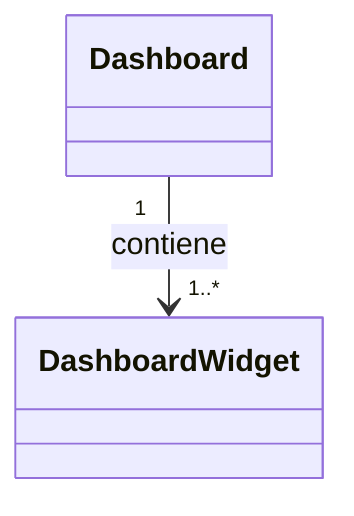

El diagrama representa la estructura conceptual del dominio Dashboard.

Cada tablero puede contener múltiples widgets utilizados para presentar información estratégica del negocio.

En esta etapa del modelo no se incluyen atributos, operaciones ni detalles de implementación.

---

## 17.5 Interpretación del Dominio

El dominio Dashboard representa la capa conceptual encargada de organizar y presentar la información estratégica generada por los diferentes dominios de GANUS Enterprise Platform.

Su responsabilidad consiste en estructurar la visualización de indicadores, alertas, métricas y demás elementos de información que apoyan la supervisión de la operación y la toma de decisiones por parte de los usuarios.

Cada tablero constituye un espacio de visualización compuesto por uno o varios widgets, los cuales representan diferentes perspectivas de la información empresarial sin alterar su origen ni su significado.

Este dominio no genera información, no ejecuta cálculos ni interpreta reglas del negocio; únicamente proporciona la organización conceptual mediante la cual los resultados producidos por otros dominios pueden ser presentados de forma estructurada y comprensible.

## 17.6 Responsabilidades de las Clases

### Dashboard

**Descripción**

Representa un tablero conceptual utilizado para organizar la visualización de la información estratégica del negocio.

**Responsabilidades**

- Representar un tablero empresarial.
- Organizar la presentación de información.
- Agrupar widgets relacionados.
- Facilitar la supervisión de la operación.

---

### DashboardWidget

**Descripción**

Representa un componente conceptual contenido dentro de un tablero.

Cada widget presenta una parte específica de la información proveniente de otros dominios del Core Empresarial.

**Responsabilidades**

- Representar un componente visual.
- Presentar información especializada.
- Facilitar la organización del tablero.
- Mantener independencia respecto a la generación de la información.

---

## 17.7 Relaciones con otros Dominios

El dominio Dashboard organiza conceptualmente la información producida por los diferentes dominios del Core Empresarial para facilitar su visualización y análisis por parte de los usuarios.

Las relaciones conceptuales con los demás dominios son las siguientes:

| Dominio | Relación |
|----------|----------|
| Organización | Los tableros presentan información correspondiente a una organización y sus fincas. |
| Inventario | Los tableros muestran información relacionada con los activos administrados. |
| Field Engine | Los tableros pueden presentar información obtenida mediante formularios. |
| Valores | Los valores registrados constituyen una fuente de información para los tableros. |
| Identificación | Los tableros pueden organizar información utilizando identificadores de activos. |
| Relaciones | Los tableros pueden representar información derivada de las relaciones entre activos. |
| MAKE | Los tableros muestran información generada durante la ejecución de actividades. |
| Knowledge Studio | Los tableros presentan resultados derivados del conocimiento empresarial. |
| Analytics | Los indicadores calculados son una de las principales fuentes de información de los tableros. |
| Alertas | Los tableros presentan las alertas generadas por la plataforma. |
| Advisory | Los tableros pueden incorporar recomendaciones generadas para apoyar la toma de decisiones. |

El dominio Dashboard constituye la capa conceptual de visualización del Core Empresarial y organiza la información generada por los demás dominios sin modificar su significado ni responsabilidad.

---

## 17.8 Decisiones Arquitectónicas

Durante el diseño del dominio Dashboard se adoptan las siguientes decisiones arquitectónicas:

- Toda información visual será organizada mediante tableros.
- Cada tablero estará compuesto por uno o varios widgets.
- Los widgets representarán información proveniente de otros dominios del Core Empresarial.
- Dashboard no genera información ni realiza cálculos empresariales.
- La organización visual será independiente del origen de los datos.
- Dashboard constituirá la capa conceptual de presentación del Core Empresarial.

Estas decisiones deberán mantenerse consistentes durante la evolución del modelo del dominio.

---

## 17.9 Observaciones

El dominio Dashboard representa exclusivamente la organización conceptual de la información presentada a los usuarios dentro de GANUS Enterprise Platform.

La generación de indicadores corresponde al dominio Analytics, la detección de situaciones relevantes pertenece al dominio Alertas y la construcción del conocimiento empresarial corresponde a Knowledge Studio.

Los tableros proporcionan un mecanismo uniforme para presentar información estratégica sin modificar la responsabilidad de los dominios que la generan.

La incorporación de nuevas clases dentro del dominio Dashboard únicamente podrá realizarse cuando exista una modificación oficial del negocio o de la arquitectura empresarial.

Con la aprobación de este dominio se establece el modelo conceptual oficial para la organización y presentación de la información estratégica dentro de GANUS Enterprise Platform.

---

# 18. Dominio Advisory

## 18.1 Objetivo

El dominio **Advisory** representa el mecanismo conceptual mediante el cual GANUS Enterprise Platform genera recomendaciones empresariales para apoyar la toma de decisiones.

Su propósito consiste en modelar las recomendaciones derivadas del conocimiento empresarial, los indicadores y las alertas, proporcionando orientación para mejorar la operación del negocio.

Este dominio constituye la capa conceptual de asistencia a la decisión del Core Empresarial.

---

## 18.2 Alcance

El dominio Advisory comprende la administración conceptual de las recomendaciones generadas por la plataforma.

Su alcance incluye:

- Definición de recomendaciones.
- Organización conceptual de sugerencias empresariales.
- Asociación de recomendaciones con el contexto del negocio.
- Disponibilidad de recomendaciones para los usuarios.

No forma parte del alcance de este dominio:

- La captura de información.
- La ejecución de actividades.
- La generación de indicadores.
- La definición de reglas del negocio.
- La administración de activos.

Estas responsabilidades pertenecen a otros dominios del modelo.

---

## 18.3 Clases Oficiales

El dominio Advisory está conformado por las siguientes clases oficiales:

| Clase | Descripción |
|--------|-------------|
| PreguntaAdvisory | Representa la consulta conceptual utilizada para iniciar un proceso de recomendación. |
| RespuestaAdvisory | Representa la recomendación conceptual generada como resultado del análisis empresarial. |

Estas clases constituyen el núcleo conceptual del dominio Advisory y representan el mecanismo mediante el cual la plataforma asiste la toma de decisiones.

---

## 18.4 Diagrama UML

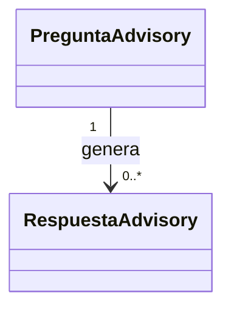

El diagrama representa la estructura conceptual del dominio Advisory.

Las preguntas representan el contexto desde el cual se solicita una recomendación, mientras que las respuestas representan las recomendaciones generadas conceptualmente por la plataforma.

En esta etapa del modelo no se incluyen atributos, operaciones ni detalles de implementación.

---

## 18.5 Interpretación del Dominio

El dominio Advisory representa la capa conceptual mediante la cual GANUS Enterprise Platform proporciona recomendaciones empresariales para apoyar la toma de decisiones.

Su responsabilidad consiste en representar las consultas realizadas sobre el conocimiento empresarial y las recomendaciones generadas como resultado del análisis de la información proveniente de los diferentes dominios del Core Empresarial.

Cada recomendación constituye una orientación conceptual construida a partir del conocimiento disponible, permitiendo asistir a los usuarios durante la planificación, supervisión y mejora continua de la operación.

Este dominio no genera conocimiento ni ejecuta reglas del negocio; únicamente representa conceptualmente el mecanismo de consulta y recomendación derivado del conocimiento empresarial.

---

## 18.6 Responsabilidades de las Clases

### PreguntaAdvisory

**Descripción**

Representa la consulta conceptual realizada para obtener una recomendación empresarial dentro de GANUS Enterprise Platform.

Cada pregunta define el contexto desde el cual se solicita asistencia para la toma de decisiones.

**Responsabilidades**

- Representar una consulta empresarial.
- Definir el contexto de análisis.
- Iniciar un proceso conceptual de recomendación.
- Servir como punto de entrada para Advisory.

---

### RespuestaAdvisory

**Descripción**

Representa la recomendación conceptual generada como resultado del análisis realizado por el dominio Advisory.

Cada respuesta proporciona orientación empresarial basada en el conocimiento disponible dentro del Core Empresarial.

**Responsabilidades**

- Representar una recomendación empresarial.
- Proporcionar orientación conceptual.
- Responder a una consulta del negocio.
- Apoyar la toma de decisiones.

---

## 18.7 Relaciones con otros Dominios

El dominio Advisory utiliza la información generada por los diferentes dominios del Core Empresarial para producir recomendaciones conceptuales orientadas a la toma de decisiones.

Las relaciones conceptuales con los demás dominios son las siguientes:

| Dominio | Relación |
|----------|----------|
| Organización | Las recomendaciones consideran el contexto organizacional de la empresa y sus fincas. |
| Inventario | Las recomendaciones pueden involucrar activos administrados por la plataforma. |
| Field Engine | Advisory puede utilizar información obtenida mediante formularios. |
| Valores | Los valores registrados constituyen una fuente de información para las recomendaciones. |
| Identificación | Las recomendaciones pueden referirse a activos identificados. |
| Relaciones | Advisory considera las relaciones existentes entre los activos. |
| MAKE | Las recomendaciones utilizan información derivada de la ejecución de actividades. |
| Knowledge Studio | Advisory consume el conocimiento empresarial generado por las reglas del negocio. |
| Analytics | Advisory utiliza indicadores como apoyo para la generación de recomendaciones. |
| Alertas | Advisory considera las alertas detectadas para orientar la toma de decisiones. |
| Dashboard | Las recomendaciones pueden presentarse dentro de los tableros empresariales. |

El dominio Advisory constituye la capa conceptual de asistencia a la decisión dentro del Core Empresarial.

---

## 18.8 Decisiones Arquitectónicas

Durante el diseño del dominio Advisory se adoptan las siguientes decisiones arquitectónicas:

- Toda recomendación empresarial será representada mediante una respuesta conceptual.
- Las consultas constituirán el punto de entrada del proceso de recomendación.
- Advisory utilizará conocimiento proveniente de Knowledge Studio.
- Advisory podrá apoyarse en indicadores y alertas para generar recomendaciones.
- El dominio Advisory no administra información operacional ni ejecuta reglas del negocio.
- Advisory constituye la capa conceptual de asistencia a la decisión del Core Empresarial.

Estas decisiones deberán mantenerse consistentes durante la evolución del modelo del dominio.

---

## 18.9 Observaciones

El dominio Advisory representa exclusivamente el modelo conceptual utilizado para asistir la toma de decisiones dentro de GANUS Enterprise Platform.

Las recomendaciones se construyen utilizando conocimiento empresarial, indicadores y alertas generados por los dominios correspondientes, sin modificar la responsabilidad de dichos dominios.

Advisory proporciona un mecanismo uniforme para representar consultas y recomendaciones empresariales dentro del Core Empresarial.

La incorporación de nuevas clases dentro del dominio Advisory únicamente podrá realizarse cuando exista una modificación oficial del negocio o de la arquitectura empresarial.

Con la aprobación de este dominio se establece el modelo conceptual oficial para la asistencia a la decisión dentro de GANUS Enterprise Platform.

---

